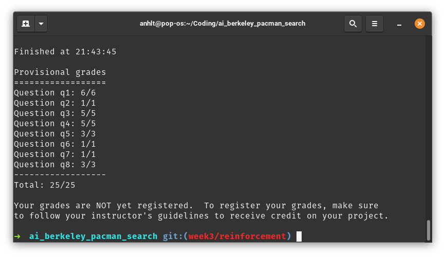

# Week 3 - Reinforcement Learning

**Điểm cuối cùng**: 25/25



## Câu 1: Value Iteration

Áp dụng công thức của MDP để xác định giá trị của từng ô.

## Câu 2: Bridge Crossing Analysis

Để agent chấp nhận đi qua cầu, cài đặt độ nhiễu thấp để giá trị của các ô trên cầu không bị ảnh hưởng bởi giá trị của các ô nguy hiểm xung quanh. Discount cần đặt đủ cao để giá trị ô +10 vẫn tốt hơn ô +1 sau khi qua cầu.

## Câu 3:

```py
def question3a():
    answerDiscount = 0.9 # để agent chọn đường đi ngắn hơn
    answerNoise = 0 # để agent chọn đi gần cliff
    answerLivingReward = -4 # để agent muốn exit nhanh hơn
    return answerDiscount, answerNoise, answerLivingReward

def question3b():
    answerDiscount = 0.5 # để agent chọn ô +1 ở gần thay vì ô +10 ở xa
    answerNoise = 0.4 # để agent tránh cliff (do noise cao)
    answerLivingReward = -0.6 # để agent chọn ô +1 ở gần thay vì ô +10 ở xa
    return answerDiscount, answerNoise, answerLivingReward

def question3c():
    answerDiscount = 1 # để agent chọn ô +10 ở xa
    answerNoise = 0 # để agent chọn đi gần cliff
    answerLivingReward = -0.1 # đặt giá trị âm để agent muốn exit
    return answerDiscount, answerNoise, answerLivingReward

def question3d():
    answerDiscount = 0.8 # để agent chọn ô +10 ở xa
    answerNoise = 0.4 # để agent tránh cliff (do noise cao)
    answerLivingReward = -0.1 # đặt giá trị âm để agent muốn exit
    return answerDiscount, answerNoise, answerLivingReward

def question3e():
    # 
    answerDiscount = 1
    answerNoise = 0
    answerLivingReward = 1 # đặt là dương để agent không muốn exit
    return answerDiscount, answerNoise, answerLivingReward
```

## Câu 4 và 5

Áp dụng công thức của thuật toán Q-Learning và Q-Learning with Epsilon.

```py
class QLearningAgent(ReinforcementAgent):
    """
      Q-Learning Agent

      Functions you should fill in:
        - computeValueFromQValues
        - computeActionFromQValues
        - getQValue
        - getAction
        - update

      Instance variables you have access to
        - self.epsilon (exploration prob)
        - self.alpha (learning rate)
        - self.discount (discount rate)

      Functions you should use
        - self.getLegalActions(state)
          which returns legal actions for a state
    """
    def __init__(self, **args):
        "You can initialize Q-values here..."
        ReinforcementAgent.__init__(self, **args)

        "*** YOUR CODE HERE ***"
        self.qValues = util.Counter()

    def getQValue(self, state, action):
        """
          Returns Q(state,action)
          Should return 0.0 if we have never seen a state
          or the Q node value otherwise
        """
        "*** YOUR CODE HERE ***"
        return self.qValues[(state, action)]


    def computeValueFromQValues(self, state):
        """
          Returns max_action Q(state,action)
          where the max is over legal actions.  Note that if
          there are no legal actions, which is the case at the
          terminal state, you should return a value of 0.0.
        """
        "*** YOUR CODE HERE ***"
        maxValue = max([self.getQValue(state, a) for a in self.getLegalActions(state)] or [0])

        return maxValue

    def computeActionFromQValues(self, state):
        """
          Compute the best action to take in a state.  Note that if there
          are no legal actions, which is the case at the terminal state,
          you should return None.
        """
        "*** YOUR CODE HERE ***"
        maxValue = float('-inf')
        maxAction = None
        for a in self.getLegalActions(state):
          qValue = self.getQValue(state, a)
          if (qValue > maxValue):
            maxValue = qValue
            maxAction = a

        return maxAction

    def getAction(self, state):
        """
          Compute the action to take in the current state.  With
          probability self.epsilon, we should take a random action and
          take the best policy action otherwise.  Note that if there are
          no legal actions, which is the case at the terminal state, you
          should choose None as the action.

          HINT: You might want to use util.flipCoin(prob)
          HINT: To pick randomly from a list, use random.choice(list)
        """
        # Pick Action
        legalActions = self.getLegalActions(state)
        action = None
        "*** YOUR CODE HERE ***"
        chooseRandomly = util.flipCoin(self.epsilon)

        if (chooseRandomly):
          action = random.choice(legalActions) if len(legalActions) != 0 else None
        else:
          action = self.computeActionFromQValues(state)

        return action

    def update(self, state, action, nextState, reward):
        """
          The parent class calls this to observe a
          state = action => nextState and reward transition.
          You should do your Q-Value update here

          NOTE: You should never call this function,
          it will be called on your behalf
        """
        "*** YOUR CODE HERE ***"
        # get max q value of nextState, if no legal actions found, return 0
        maxQValue = max([self.getQValue(nextState, a) for a in self.getLegalActions(nextState)] or [0])

        result = reward + self.discount * maxQValue
        self.qValues[(state, action)] = (1 - self.alpha) * self.getQValue(state, action) + self.alpha * result

    def getPolicy(self, state):
        return self.computeActionFromQValues(state)

    def getValue(self, state):
        return self.computeValueFromQValues(state)
```

# Câu 6:

Kể cả khi epsilon ~1, khả năng đi được tới ô +10 một cách ngẫu nhiên ~0.1%. Nếu chỉ train agent 50 lần, thì khả năng đi qua được cầu của agent là không có.

# Câu 8:

Áp dụng công thức của Approximate Q-Learning.
